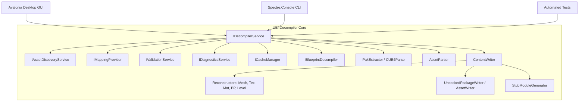

# UE4Decompiler System Architecture

This document outlines the architectural principles, component relationships, and security model of UE4Decompiler.

---

## Architectural Principles

1. **Separation of Concerns**: Core parsing and reconstruction logic are completely decoupled from UI concerns. Core contains zero console or windowing dependencies.
2. **Reusability**: The high-level `IDecompilerService` API is consumed identically by both the CLI and Avalonia GUI applications.
3. **Cross-Platform Parity**: Clean .NET 8 execution across Windows, Linux, and macOS without OS-specific hard-coded assumptions or paths.
4. **Security by Design**: Strict path traversal prevention (`PathUtils.SafeCombine`), sanitized project and file names, and memory protection for encryption keys.

---

## Solution Project Structure

```
UE4Decompiler/
├── src/
│   ├── UE4Decompiler.Core/          # Reconstructors, Writers, Containers, Services, Abstractions
│   ├── UE4Decompiler.Cli/           # Spectre.Console CLI application & subcommands
│   └── UE4Decompiler.Gui/           # Avalonia UI desktop application (MVVM)
├── tests/
│   └── UE4Decompiler.Tests/         # Unit, integration, and regression tests
├── lib/                             # Direct CUE4Parse and decompression assemblies
├── docs/                            # Documentation suite
└── scripts/                         # Build, test, and packaging scripts
```

---

## Core Services & Abstractions



---

## Security Model

- **Path Traversal Protection**: Every output file write undergoes canonical root resolution via `PathUtils.SafeCombine()`. Any relative path containing `../`, `..\`, or attempting to resolve outside the destination directory throws an `InvalidOperationException`.
- **Sanitized Naming**: Project names, file outputs, and generated C++ classes are sanitized against operating system reserved characters (`<`, `>`, `:`, `"`, `/`, `\`, `|`, `?`, `*`) and control characters.
- **Sensitive Key Masking**: AES keys are processed in memory and never persisted in plain text into generated project files or public manifest summaries.
